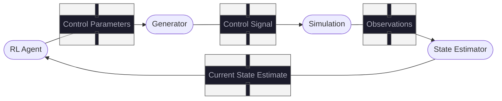
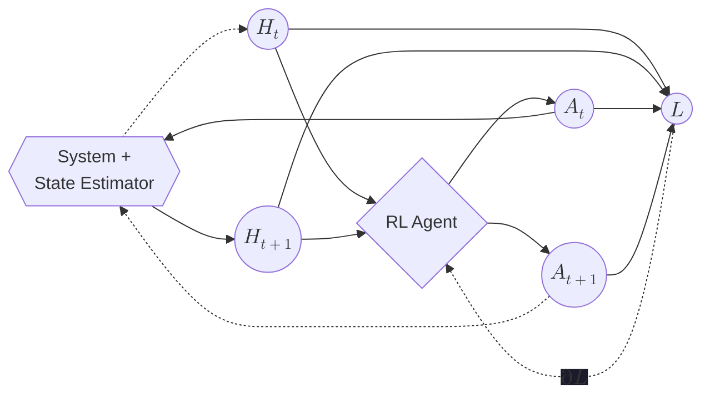
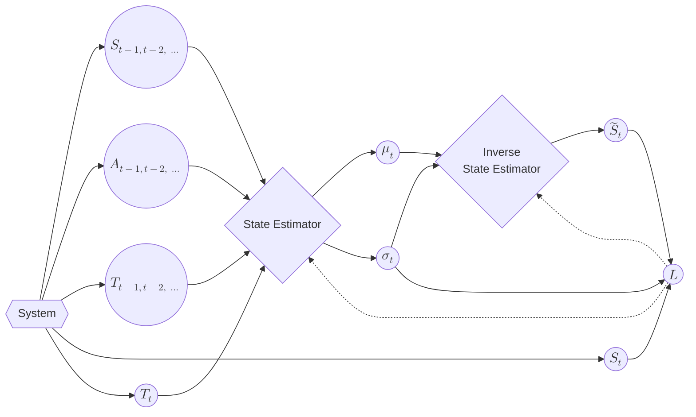

# Build Guide

Build with the following line of `bash` code:
```bash
cargo build --release
```

# Inference Flow



# Message Types

### Hyperparameters

```rust
/// A tuple of dimensions in the latent embedding of the system state.
const LATENT_SPACE_SHAPE: (usize,);

/// The number of previous observations and controls to use to Markovianize the
/// process with the state estimator.
const DELAY_DEPTH: usize;
```

### System Dependent

```rust
/// The number of observable components of the state.
const OBSERVABLE_SHAPE: (usize,);

/// The number of components of the control parameters.
const CONTROL_PARAMETER_SHAPE: (usize,);

/// The number of components of the control signal.
const CONTROL_SIGNAL_SHAPE: (usize,);
```

```rust
type ObservableState <== Tensor<T, OBSERVABLE_SHAPE>;
type ControlParameterState <== Tensor<T, CONTROL_PARAMETER_SHAPE>;
type ControlSignalState <== Tensor<T, CONTROL_SIGNAL_SHAPE>;
type StateTensor <== Tensor<T, LATENT_SPACE_SHAPE>;

struct Observation {
    state: ObservableState,
    controls: ControlSignalState,
    time_observed: f64,
}

struct Observations([Observation; DELAY_DEPTH]);
struct CurrentStateEstimate(StateTensor);
```

# Training Flow

### RL Agent

Note that here, $H_n$ refers to the observations from the state estimator and
$A_n$ refers to the actions produced by the reinforcement learning agent.



### State Estimator

Note that here, $S_n$ refers to the observations from the simulations, $A_n$
refers to the actions produced by the generator, and $T_n$ refers to the
encoded time.



### Next Steps
---

- Documentation
- Implement (& Test) the driver, state-estimator
- Test the Execution Loop
- Test the Simulator
- Integration Tests
